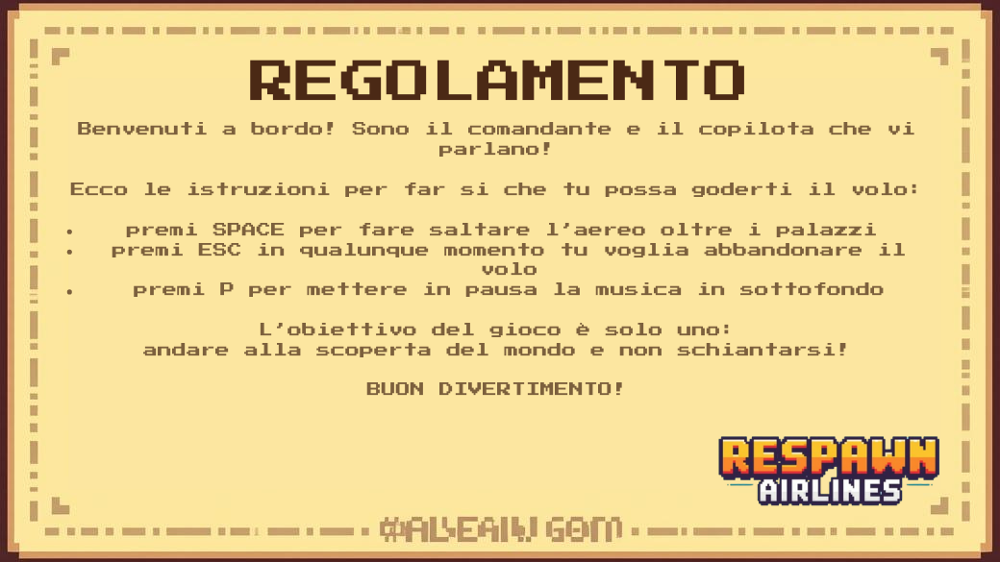

# respawn_airlines

Alessia Dornescu ha creato le immagini dello sfondo e dei palazzi, il loro funzionamento e movimento, le collisioni con i palazzi, i file score e highscore, i commenti.
Emanuela Guerra ha creato il regolamento, l'immagine della schermata home e dell'aereo, il movimento dell'aereo, i pulsanti e aggiunto i suoni.
Tutte le immagini sono state create con Canva AI e il regolamento è stato scritto a mano da Emanuela Guerra su Canva. 
Mask è stato usato con l'aiuto di ChatGPT.

